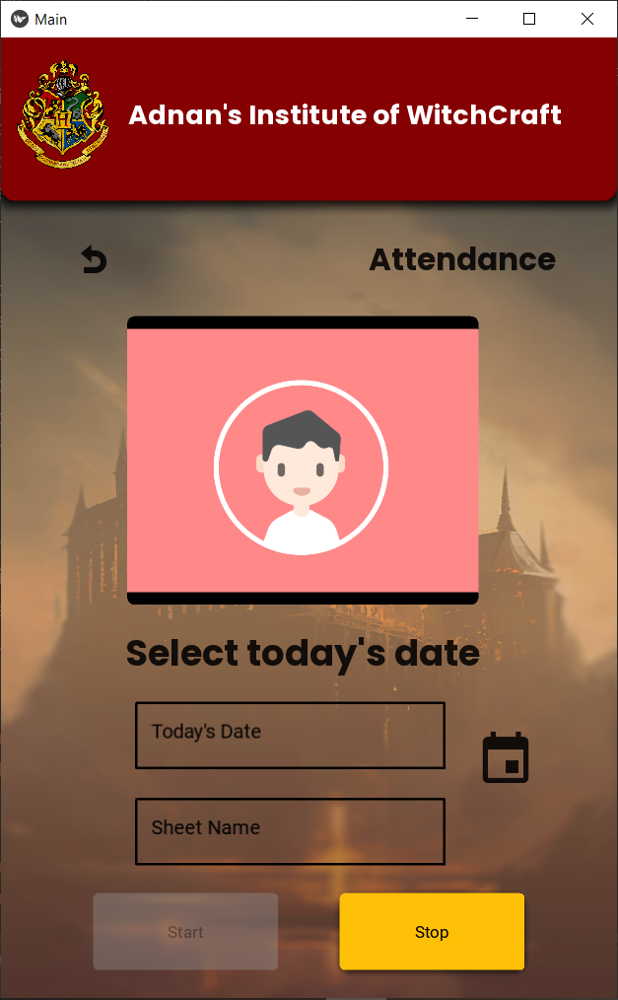

### School App - with Facial Recognition

This application was a part of my Final Year's project.
Took me around 1.5 Months to complete this project.

Below are the core modules present within the application

## Facial Recognition (OpenCV)
- The ability to mark a student's attendance using Facial Recognition
- The attendance is marked for the day in an XL sheet.

## PDF to Images Converter
- This module converts PDFs to images so that the students can read books from the app itself
- It is done by taking each page of the pdf and adding it to a card in the carousel.
   

##  Add Students & Generate I-Card
- Students can be added in the database followed by an I-card being generated and sent via mail
   

## Result Maker
- Teachers can make result followed by result being sent on Mail
      

## Test Maker and Time Table Maker
- Create tests by adding questions and correct answers
- Create Time Tables for the week
   

## HomePage
   

### Other Modules
   
   

### How to Run
- Run main.py

### Prerequisites
# Make sure your PC has the following libraries/apps
- CMake
- OpenCV
- Python
- MongoDB
- IMG2PDF
- openpyxl
- Kivy
- KivyMD

### Thoughts
This was my first ever large scale project, although it may have a couple of bugs here and there, it is a pretty straight forward and visualy pleasing app.
I had alot of fun making this, will hopefully make better ones in the future. 

